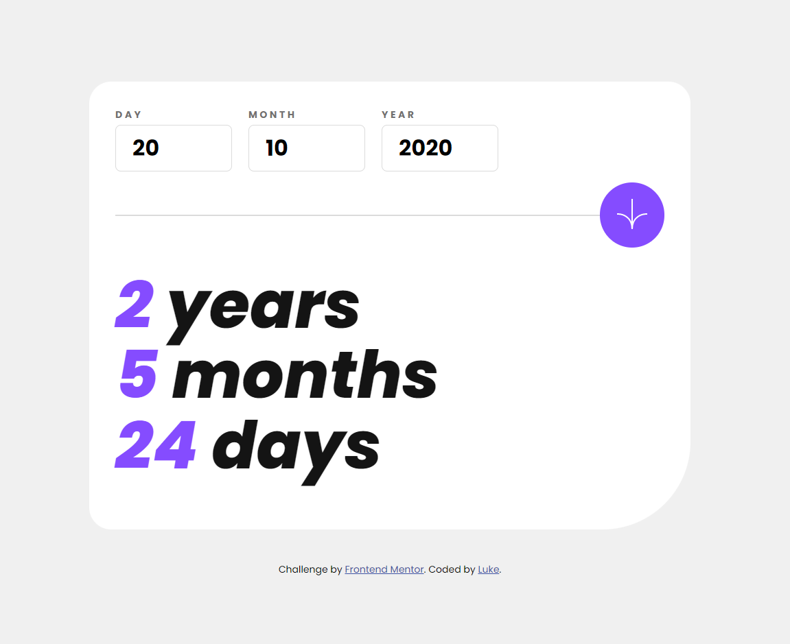

# Frontend Mentor - Age calculator app solution

This is a solution to the [Age calculator app challenge on Frontend Mentor](https://www.frontendmentor.io/challenges/age-calculator-app-dF9DFFpj-Q). Frontend Mentor challenges help you improve your coding skills by building realistic projects.

## Table of contents

- [Overview](#overview)
  - [The challenge](#the-challenge)
  - [Screenshot](#screenshot)
  - [Links](#links)
- [My process](#my-process)
  - [Built with](#built-with)
  - [What I learned](#what-i-learned)
  - [Useful resources](#useful-resources)
- [Author](#author)

## Overview

### The challenge

Users should be able to:

- View an age in years, months, and days after submitting a valid date through the form
- Receive validation errors if:
  - Any field is empty when the form is submitted
  - The day number is not between 1-31
  - The month number is not between 1-12
  - The year is in the future
  - The date is invalid e.g. 31/04/1991 (there are 30 days in April)
- View the optimal layout for the interface depending on their device's screen size
- See hover and focus states for all interactive elements on the page

### Screenshot



### Links

- Solution URL: [Add solution URL here](https://your-solution-url.com)
- Live Site URL: [Add live site URL here](https://your-live-site-url.com)

## My process

### Built with

- Semantic HTML5 markup
- CSS custom properties
- Flexbox
- Desktop-first workflow
- Vanilla Javascript

### What I learned

One of challenges I encountered while building this was making the ```new Date()``` take in the inputted value. It took me iterating in the console to find out that it only takes in th value if there's a `/` or a `-` seperating the values.

```js
let birthDate = new Date(userMonth+"-"+userDay+"-"+userYear);  

let differenceInMilliseconds = currentDate.getTime() - birthDate.getTime();
```

### Useful resources

- [Stack Overflow](https://www.stackoverflow.com/questions/9229213/convert-iso-date-to-milliseconds-in-javascript#:~:text=var%20date%20%3D%20new%20Date(date_string,This%20worked%20for%20me!) - This helped me understand how dates work in Javascript.

## Author

- Website - [Luke Bamtefa](https://luke-at.me)
**- Frontend Mentor - [@yourusername](https://www.frontendmentor.io/profile/yourusername)**
- Twitter - [@donotlukeatme](https://www.twitter.com/donotlukeatme)
